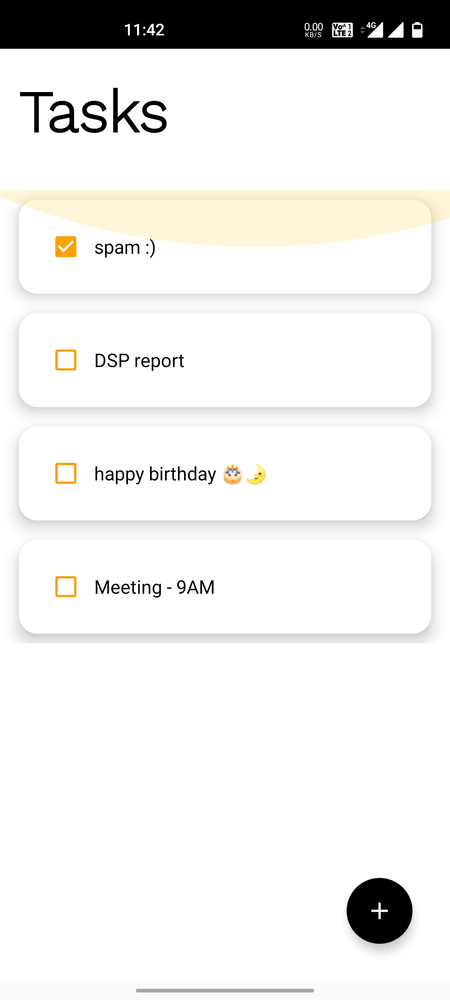
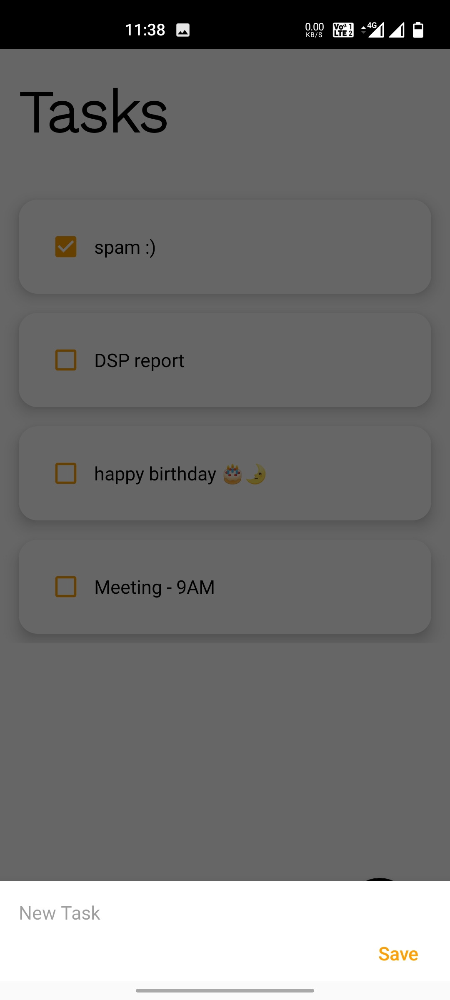
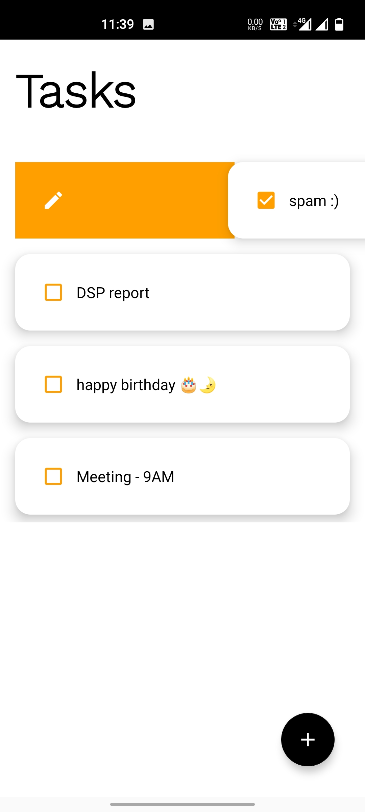
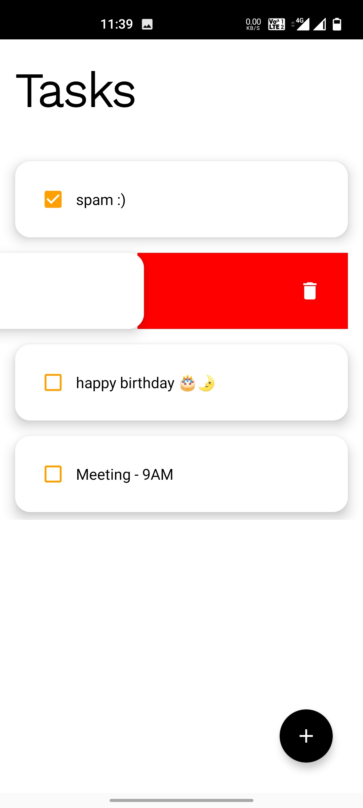

# LineUp App
## Description
* This is basically a To Do list application which comes with a simple come enhanced design and UI.
  This application is very handy to use which helps you organize tasks and stay on top of your deadlines.
  App comes with handy features like you can edit or delete an already added task with a simple swipe (Left/Right), you can even checkout the task after it is done.
  You can use it to manage everything from grocery lists to work-related tasks and more.
* Uses MYSQLite for Database storage.

## Screenshots
### HomeScreen

### New Task Function

### Right Swipe - Edit Option

### Left Swipe - Delete Option

